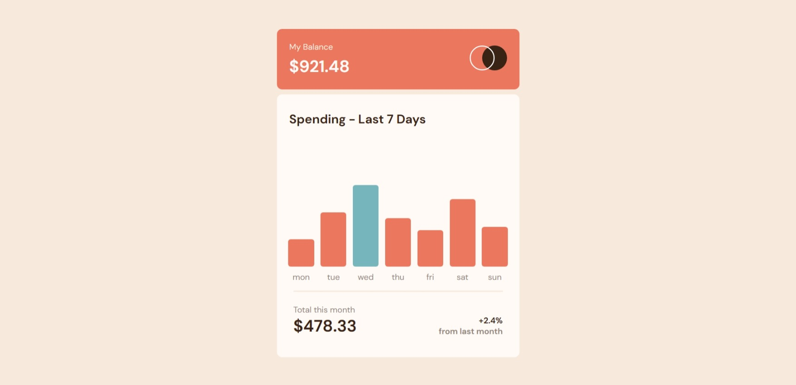

# Frontend Mentor - Expenses chart component solution

This is a solution to the [Expenses chart component challenge on Frontend Mentor](https://www.frontendmentor.io/challenges/expenses-chart-component-e7yJBUdjwt). Frontend Mentor challenges help you improve your coding skills by building realistic projects. 

## Table of contents

- [Overview](#overview)
  - [The challenge](#the-challenge)
  - [Screenshot](#screenshot)
  - [Links](#links)
- [My process](#my-process)
  - [Built with](#built-with)
  - [Useful resources](#useful-resources)
- [Author](#author)

## Overview

### The challenge

Users should be able to:

- View the bar chart and hover over the individual bars to see the correct amounts for each day
- See the current day’s bar highlighted in a different colour to the other bars
- View the optimal layout for the content depending on their device’s screen size
- See hover states for all interactive elements on the page
- **Bonus**: Use the JSON data file provided to dynamically size the bars on the chart

### Screenshot

### Links

- Solution URL: [github](https://github.com/salma247/expense-chart-component/)
- Live Site URL: [live site](https://salma247.github.io/expense-chart-component/)

## My process

### Built with

- Semantic HTML5 markup
- CSS custom properties
- Flexbox
- Javascript (fetch API)

### Useful resources

- [Fetch API](https://www.javascripttutorial.net/javascript-fetch-api/#:~:text=%20JavaScript%20Fetch%20API%20%201%20Sending%20a,status%20code%20and%20status%20text%20via...%20More%20) 
- [JS promises](https://developer.mozilla.org/en-US/docs/Web/JavaScript/Reference/Global_Objects/Promise) - This is an amazing article which helped me finally understand promises. I'd recommend it to anyone still learning this concept.

## Author

- Frontend Mentor - [@salma247](https://www.frontendmentor.io/profile/salma247)

